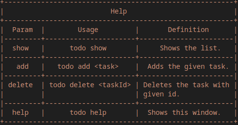

# ToDo app
Simple CLI ToDo app written in go.

## Project description
Project was made because I wanted to learn go. In the future I'll make more advanced go projects.
Maybe it's not absolute garbage but idk. If you want to know how this gibberish works:
* It reads the first argument and stores it in 'instruction' variable,
* then it runs switch case of this instruction,
* then depending on what instruction was given as an argument, it calls the right function.
  
I think that the rest is clear idk it's only 132 lines of code.

## Manual

